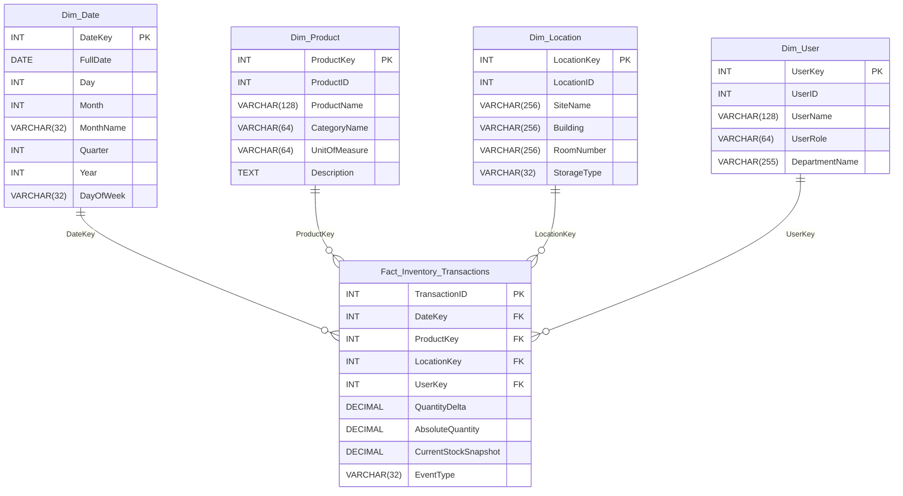

# 🧪 LabHub — Inventory Intelligence Platform
*A full OLTP → OLAP warehouse with ETL, Data Quality, semantic search, and a Streamlit analytics dashboard.*

## [Link Text](https://vectorlab.streamlit.app/)
---

## 📌 Overview

LabHub is a complete data engineering project that simulates a real-world inventory intelligence system. It includes:

- **SQL Server OLTP** database (core product, user, vendor, inventory tables)  
- **DuckDB OLAP warehouse** with a Kimball-style star schema  
- **Python ETL pipeline** (dimensions, facts, DQ gatekeeper, rollback logic)  
- **Data Quality framework** with critical/warning checks  
- **Semantic search** using ChromaDB + embeddings  
- **Streamlit dashboard** for KPIs and inventory insights  
- **Documentation, diagrams, and SQL build scripts**

This project demonstrates modern data engineering practices: incremental loads, DQ enforcement, warehouse orchestration, and vector search integration.

---

## 🏗️ Architecture
```code
SQL Server (OLTP)
        ↓
Python ETL Pipeline
        ↓
Data Quality Gatekeeper
        ↓
DuckDB Warehouse (OLAP)
        ↓
Streamlit Dashboard + Vector Search
```

---

## 📁 Project Structure


```
LabHub_final_CS779/
├── analytics/                     # Backend data logic (ETL, warehouse, connections)
│   ├── data/                      # DB connectors + generated OLTP seed data
│   │   ├── connect_db.py          # Connectors for OLTP (SQL Server) & OLAP (DuckDB)
│   │   ├── generated_data_OLTP/   # Synthetic OLTP CSVs used to populate SQL Server
│   │   └── __init__.py
│   │
│   ├── etl/                       # Full ETL pipeline (dimensions, facts, DQ, orchestration)
│   │   ├── run_pipeline.py        # Main warehouse pipeline orchestrator
│   │   ├── data_quality.py        # Data Quality checks (DQ gatekeeper)
│   │   ├── old_etl_inventory.py   # Legacy ETL (kept for reference)
│   │   ├── dimensions/            # Dimension ETL modules
│   │   │   ├── dim_date.py
│   │   │   ├── dim_location.py
│   │   │   ├── dim_product.py
│   │   │   ├── dim_user.py
│   │   │   └── __init__.py
│   │   │
│   │   ├── facts/                 # Fact table ETL modules
│   │   │   ├── fact_inventory.py
│   │   │   └── __init__.py
│   │   │
│   │   └── __pycache__/           # Python cache files
│   │
│   ├── warehouse/                 # Warehouse initialization + view creation
│   │   ├── init_warehouse.py      # Creates schemas, tables, and seeds warehouse
│   │   ├── create_views.py        # Builds analytics views (KPI-ready)
│   │   ├── warehouse.duckdb       # DuckDB OLAP database file
│   │   ├── warehouse_schema.sql   # SQL schema for warehouse
│   │   └── __init__.py
│   │
│   └── __pycache__/
│
├── app/                           # Streamlit application (UI layer)
│   ├── main_dashboard.py          # Main dashboard entrypoint
│   ├── components.py              # Reusable UI components
│   ├── inventory_helpers.py       # Helper functions for dashboard logic
│   ├── styles.py                  # Custom CSS styling
│   │
│   ├── streamlit/                 # Streamlit config
│   │   └── config.toml
│   │
│   ├── ui/                        # UI modules (KPIs, layout, navigation)
│   │   ├── kpi.py
│   │   └── __init__.py
│   │
│   └── __pycache__/
│
├── chroma_db/                     # Vector database for semantic search
│   ├── chroma.sqlite3             # ChromaDB metadata
│   └── <uuid>/                    # Vector index shards
│
├── config/                        # Global configuration files (placeholder)
│
├── docs/                          # Documentation & diagrams
│   ├── architecture_diagram.png   # System architecture diagram
│   ├── oltp_to_olap_mapping.md    # Mapping between OLTP and OLAP schemas
│   └── README.md
│
├── sql db/                        # SQL Server OLTP schema + seed scripts
│   ├── CS779_LabHub_final.sql     # Full OLTP database build script
│   └── CS779_LabHub_db/           # Modular SQL scripts (tables, constraints, seeds)
│
├── static/                        # Static assets for UI
│   └── logo.png
│
└── vector/                        # Vector search logic (embeddings + retrieval)
    ├── search.py
    ├── vector_store.py
    └── __init__.py

```

---


## ⭐ Dimensional Model (Mermaid Diagram)



---

## 🔄 ETL Pipeline
1. Dimension Loads
- **Date**
- **Product**
- **User**
- **Location**

2. Fact Load
- **Incremental load of inventory transactions**
- **Skips rows already present in OLAP**

3. Data Quality Gatekeeper
Checks include:
- **Negative stock**
- **Orphaned foreign keys**
- **Duplicate transaction IDs**
- **Missing product descriptions**
- **Freshness (today’s data present)**

DQ Logic
- **If all PASS/WARN → COMMIT**
- **If any FAIL → move fact load to staging + ROLLBACK**

## 📊 Streamlit Dashboard
The dashboard provides:
- **Inventory KPIs**
- **Stock movement trends**
- **Product-level insights**
- **Semantic search powered by ChromaDB**
- **Clean UI with custom styling**

Run it with:

```bash
streamlit run app/main_dashboard.py
```

---

## 🛠️ Tech Stack

| Layer | Technology |
| :--- | :--- |
| **OLTP** | SQL Server |
| **OLAP** | DuckDB |
| **ETL** | Python (Pandas, DuckDB, PyODBC) |
| **DQ** | Custom Python framework |
| **UI** | Streamlit |
| **Vector Search** | ChromaDB |
| **Modeling** | Kimball (Star Schema) |


---

## 🚀 Running the Pipeline
```bash
python -m analytics.etl.run_pipeline
```

This will:
- **Load dimensions**
- **Load facts**
- **Run DQ**
- **Commit or rollback**
- **Refresh analytics views**
